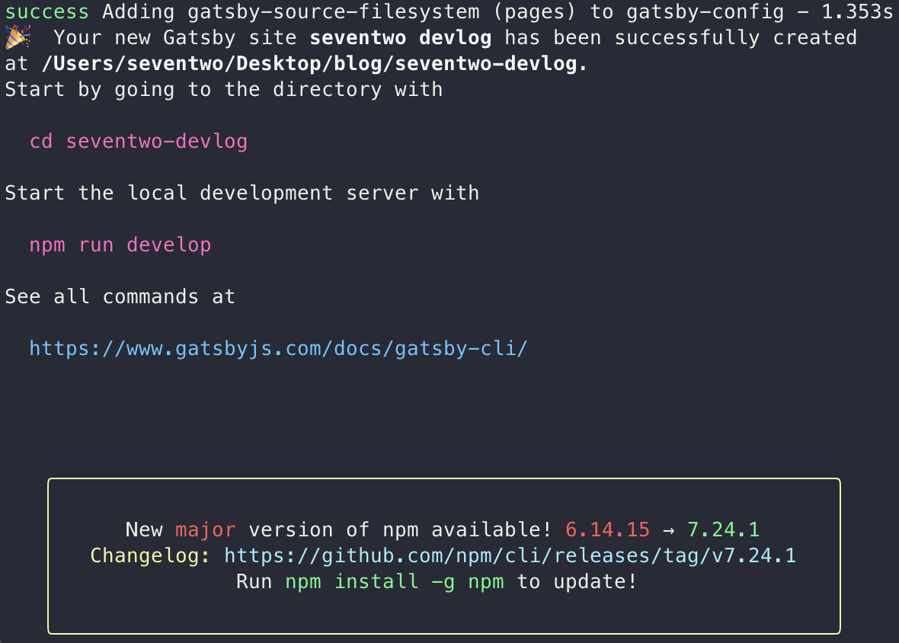

이전에 jekyll을 이용해 기술 블로그를 만들어본 경험이 있는데.. 지금 와서 생각해보니 너무.. 개발자스럽지 않게(?) 만든 것 같고.. 또 본인이 기술적으로 조금 성장했으니 Gatsby 공식 문서를 보고 (기타 다른 분들의 삽질기를 보지 않고) 만들어 보려고 합니다.

만약 이 글을 보고 있는 여러분도 저처럼 **삽질을 해보며 개발하는 것을 좋아한다면** 이 연재물을 보지 않는 것을 추천합니다.

그럼 매우 부족하지만 저의 삽질기를 읽어주셔서 미리 감사드립니다.. 🤪

<br>

---

<br>

## npm init gatsby

```bash
$ npm init gatsby
```

공식문서를 보니 일단 이렇게 cli를 입력하라고 해서 해보았더니 각종 라이브러리(?)를 미리 설치할 수 있게 질문을 몇가지 던집니다..

전혀 들어보지도 못한 라이브러리도 많아서 그냥 본인이 사용해본 `styled-component`와 markdow support를 추가했습니다.



짠..! 순조롭다.. 당연히 순조로워야하지만..

이제부터 [공식문서](https://www.gatsbyjs.com/docs/tutorial/)의 tutorial을 읽어보면서 나만의 기술블로그를 만들어보자 !! 😂

<br>

---

<br>

## typescript, eslint, prettier

이전에 블로그를 만들면서 개발 환경을 구성하지도 않고.. `typescript`도 잘 모르고.. 그래서 그냥 막 만들었더니 유지 보수(?)하기 정말 힘들게 코드를 작성한 경험이 있습니다.

이번에 블로그를 만들면서는 조금 더 좋은 코드로 블로그를 구현하기 위해 `typescript`, `eslint`, `prettier` 등을 이용하여 블로그를 개발하고자 했습니다 😇

늘 프로젝트를 진행하면서 느끼지만.. 환경 구성하는게 항상 귀찮고.. 제일 어려운 것 같습니다..😅

<br>

### typescript 추가하기

`JavaScript`를 이용해서 블로그를 만들어도 되긴 하겠지만, `TypeScript`도 배웠고.. `TypeScript`의 장점을 체감해봤기 때문에.. `TypeScript`를 이용해서 개발을 진행하고자 했습니다.

`Gatsby`에 TypeScript를 추가하는 것은 그리 어려운 일은 아니었습니다 !

- `TypeScript` 설치하기

  ```bash
  $ npm i -D typescript
  ```

- `gatsby-plugin-typescript` 설치 및 추가하기

  ```bash
  $ npm i gatsby-plugin-typescript
  ```

  ```javascript
  // gatsby-config.js
  plugins: [
    'gatsby-plugin-typescript',
    // ...
  ];
  ```

- `tsconfig.json` 추가하기

  ```json
  {
    "compilerOptions": {
      "target": "esnext",
      "module": "commonjs",
      "allowJs": true,
      "lib": ["DOM", "ESNext"],
      "strict": true,
      "isolatedModules": true,
      "esModuleInterop": true,
      "jsx": "preserve",
      "outDir": "./public",
      "baseUrl": "."
    },
    "include": ["src/**/*"],
    "exclude": ["node_modules", "public", ".cache"]
  }
  ```

  - 매번 tsconfig의 각 옵션들이 뭘 의미하는지도 모르고 작성했었는데 이전에 **우아한 테크캠프**를 진행하면서 [태균님이 정리해주신 내용](https://velog.io/@sooran/tsconfig.json-%EC%A0%9C%EB%8C%80%EB%A1%9C-%EC%95%8C%EA%B3%A0-%EC%82%AC%EC%9A%A9%ED%95%98%EA%B8%B0)을 참고하고 공부해보니 많은 도움이 되었습니다 ㅎㅎ 한번 보시는걸 추천드려요 ! ☺️
  - `compilerOptions`에 **path**를 추가하고 [gatsby webpack customize](https://www.gatsbyjs.com/docs/how-to/custom-configuration/add-custom-webpack-config/)를 참고하여 import를 좀 더 수월하게 하는 방법도 있으니 참고해보세요 ~

이정도 구성하게 되면 typescript를 사용할 수 있습니다 !

<br>

### prettier, ESLint 추가하기

이 부분을 정리하고자 했으나.. 사실 저보다 더욱 더 잘 아시고.. 또 잘 정리되어있는 게시물들이 많아서 저도 이 부분만큼은 몇몇 기술 블로그들을 참고해서 작성했습니다..!

[참고 블로그](https://www.josephk.io/setup-typescript-gatsby/)에서 참고하시고 설정을 추가해주시면 좋을 것 같아요 😅

저도 위 블로그를 참고해서 `eslint`, `husky`, `lint-staged`를 추가하였는데, 오류가 발생하더라구요 !

콘솔에 찍힌 에러를 잘 확인해보니 `prettier/@typescript-eslint` 와 `prettier/react`가 `prettier` 플러그인에 합병(?)되었다고 나왔습니다.. 이 부분을 `.eslintrc.js`에서 지워주시고 lint를 돌려보시면 에러가 발생하지 않는 것을 확인할 수 있습니다 !
