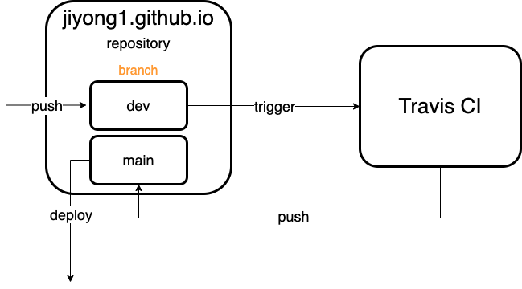
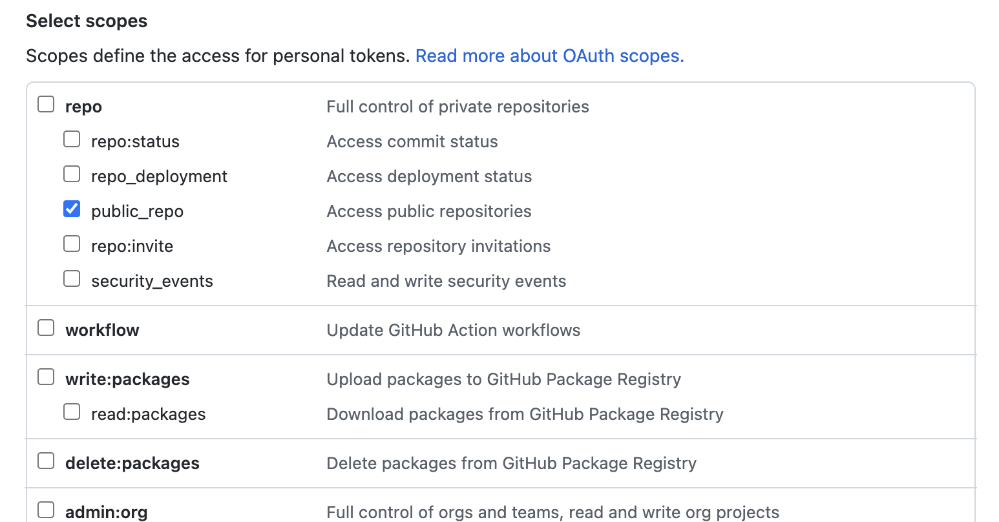
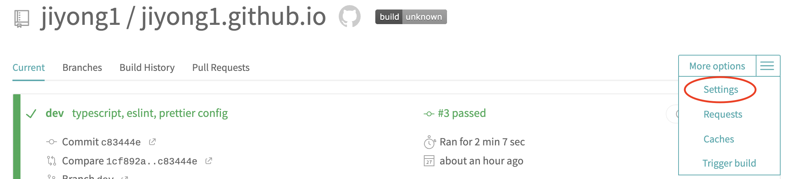
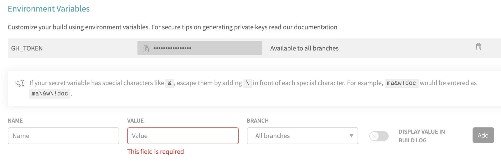

이번 화에서는 자동 배포를 해보도록 하겠습니다 😊

제가 구현한 방법이 정답은 아니라는 것을 명심해주세요.. 🙃

그럼 매우 부족하지만 저의 삽질기를 읽어주셔서 미리 감사드립니다.. 🤪

<br>

---

<br>

## 자동 배포 과정

제 블로그의 자동 배포 과정은 다음과 같습니다 !



1. **{github username}.github.io** repository의 `dev` 브랜치에 push를 한다.
2. **Travis CI**에서 이를 알아차리고 명령을 수행한다.
   - gatsby cli를 통해 프로젝트를 **build**한다.
   - **Travis CI**에서 `main` 브랜치에 자동 푸쉬 한다.

이전에 `Docker`를 학습하면서 **Travis CI**를 사용한 경험이 있어서 저는 Travis CI를 사용하였습니다. 꼭 그래야만 하는건 아니니 다른 방법을 사용해서 하셔도 됩니다 😀

<br>

## 자동 배포 하기

[gatsby 공식문서](https://www.gatsbyjs.com/docs/how-to/previews-deploys-hosting/how-gatsby-works-with-github-pages/#gatsby-skip-here)를 참고하여 진행하였습니다 !

1. `gh-pages` 패키지 다운로드

   ```bash
   $ npm i -D gh-pages
   ```

2. **script** 작성

   ```json
   {
     "script": {
       "deploy": "gatsby build && gh-pages -d public -b main -r https://$GH_TOKEN@github.com/<github username>/<github repository name>.git
       // ...
     }
   }
   ```

   - `GH_TOKEN` 은 Travis CI를 통해 환경 변수로 등록해주어야 합니다 !
   - `github username`과 `github repository name`을 형식에 맞게 작성해주세요 !

3. `GH_TOKEN` 발급 받기

   - github **Settings** > **Developer settings** > **Personal access tokens**로 이동
   - **Generate new token**을 통해 토큰 생성
   - `public repo`만 선택하고 토큰을 생성해도 됩니다 !
     

4. **Travis CI** 환경 변수 등록하기 (`GH_TOKEN`)

   

   <br>

   

5. `.travis.yml` 작성하기

   ```yaml
   language: node_js
   before_script:
     - npm install -g gatsby-cli
   node_js:
     - lts/*
   deploy:
     provider: script
     script: npm install && npm run deploy
     skip_cleanup: true
     on:
       branch: dev
   ```

   - 공식문서에는 `node_js`의 버전을 **10**으로 하였는데, 저는 오류가 발생했습니다 (gh-pages 버전과 호환이 안되는 것 같아요). 그래서 가장 최신의 lts 버전으로 변경하였습니다 !
   - deploy를 수행하기 전에 `before_script`를 통해서 `gatsby-cli`를 설치합니다.
   - `package.json`에 있는 **dependencies**들을 다운로드 받고, sciprt에 등록해두었던 deploy를 수행합니다.
   - `dev` 브랜치에 푸쉬되었을때만 위와 같은 명령들을 수행합니다 !

이제 `dev` 브랜치에 push하시면 자동으로 build하여 main branch에 push하게 될겁니다.. ~~물론 성공했다면..~~

여러분의 성공을 기원합니다.. 긴 글 읽어주셔서 감사합니다 ! 😁
