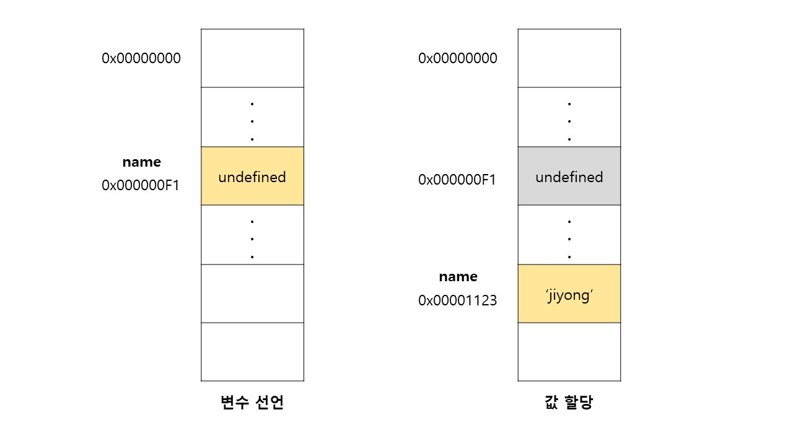

```javascript
console.log(name); // undefined 가 출력된다..!

var name; // 변수 선언문
```

- 자바스크립트는 인터프리터에 의해 한 줄씩 순차적으로 실행된다.
- 따라서 `console.log()`가 실행되는 시점에는 아직 해당 변수를 선언하지 않았으므로 참조 에러가 발생할 것처럼 보인다.
- 하지만 참조 에러가 발생되지 않는다!
- **변수 선언은 소스코드가 순차적으로 실행되는 시점, 즉 런타임이 아니라 그 이전 단계에서 먼저 실행되기 때문이다.**
- 자바스크립트 엔진은 소스코드를 한 줄씩 순차적으로 실행하기 전에 먼저 **소스코드 평가 과정**을 거치면서 소스코드를 실행하기 위한 준비를 한다.
- 소스코드 평가 과정에서 모든 선언문 (변수 선언문, 함수 선언문 등)을 소스코드에서 찾아 먼저 실행한다.
  - `var, let, const, function, function*, class` 키워드를 사용해서 선언하는 모든 식별자는 호이스팅 된다.
- 이처럼 변수 선언문이 코드의 처음으로 끌어올라간 것 처럼 동작하는 자바스크립트 고유의 특징을 `변수 호이스팅 (variable hoisting)` 이라고 한다.

<br>

## 값 할당

```javascript
var name = 'jiyong';
```

- 변수 선언과 값 할당을 단축해서 표현했다.
- 하지만 **자바스크립트 엔진은 변수 선언과 값 할당을 2개의 문으로 나누어 각각 실행한다.**
  - 변수 선언 : 런타임 이전에 먼저 실행
  - 값 할당 : 런타임에 실행



<br>

- 예시

```javascript
console.log(name); // undefined가 출력된다.

var name;
name = 'jiyong';
// var name = 'jiyong'; 과 동일

console.log(name); // jiyong이 출력된다.
```

<br>

## 함수 호이스팅

> 함수 선언문이 코드의 선두로 끌어 올려진 것 처럼 동작하는 것

```javascript
// 함수 선언문
function foo() {
  console.log('foo');
}

// 함수 표현식
var bar = function () {
  console.log('bar');
};
```

- 함수 선언문은 `함수 호이스팅`이 일어난다.
- 함수 표현식은 **변수 호이스팅**이 일어나므로 bar를 이전에 실행시킬 수 없다.
