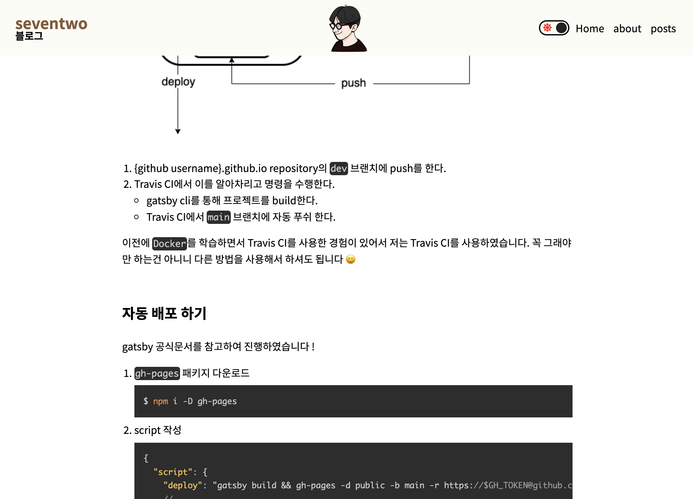

이번 화는 마크다운으로 정리된 내용(게시물)을 올리는 방법에 대해 정리해 보았습니다 🙂

1화 자동 배포 이후 개인적으로 Nav바를 만들어 놓은 상태입니다.

[공식문서](https://www.gatsbyjs.com/docs/how-to/routing/adding-markdown-pages/)가 정답임을 잊지 말아주세요 😂

<br>

## 플러그인 추가하기

1. [remark](https://remark.js.org/)를 통해서 markdown파일을 **parsing** 하는 plugin을 추가합니다.

```bash
$ npm i gatsby-transformer-remark
```

2. 파일들을 읽어드리기 위한 `filesystem` 플러그인과 앞서 설치한 remark 플러그인을 설정해줍니다. (`gatsby-config.js`)
   - 본인이 설정한 디렉토리의 구조에 따라 path를 변경해도 됩니다 !
   - `gatsby-transformer-remark` 플러그인은 앞으로 계속해서 수정될 내용이니 다음 내용들을 참고한 후 설정해주셔도 됩니다.

```javascript
// gatsby-config.js
module.export = {
  plugins: [
    {
      resolve: `gatsby-source-filesystem`,
      options: {
        name: 'markdown-page',
        path: `${__dirname}/src/posts`,
      },
    },
    'gatsby-transformer-remark',
  ],
};
```

<br>

---

<br>

## 마크다운 추가하기

앞서 설정한 디렉토리 내에 Markdown 파일을 추가합니다.

<br>

### Metadata

추가된 마크다운 파일에 대한 데이터를 추가적으로 설정할 수 있습니다. (제목, 날짜, 썸네일 등등..)

이때 ! 중요한 것은 `slug` 입니다. `slug`는 post의 url을 설정하는 것이라고 보면 될 것 같습니다.

```markdown
---
slug: '/posts/my-first-post'
date: '2021-10-08'
title: 'My first blog post'
---
```

<br>

---

<br>

## 마크다운 page 컴포넌트 작성

추가할 마크다운의 레이아웃(?)이 될 컴포넌트를 작성합니다 !

`graphql`을 통해 마크다운 페이지에 필요한 데이터를 `props`로 전달합니다.

다음은 공식문서에서 가져온 그대로의 코드입니다

```javascript
import React from 'react';
import { graphql } from 'gatsby';

export default function Template({
  data, // this prop will be injected by the GraphQL query below.
}) {
  const { markdownRemark } = data; // data.markdownRemark holds your post data
  const { frontmatter, html } = markdownRemark;
  return (
    <div className="blog-post-container">
      <div className="blog-post">
        <h1>{frontmatter.title}</h1>
        <h2>{frontmatter.date}</h2>
        <div className="blog-post-content" dangerouslySetInnerHTML={{ __html: html }} />
      </div>
    </div>
  );
}

export const pageQuery = graphql`
  query ($id: String!) {
    markdownRemark(id: { eq: $id }) {
      html
      frontmatter {
        date(formatString: "MMMM DD, YYYY")
        slug
        title
      }
    }
  }
`;
```

- 저 같은 경우에는 date의 format을 변경하기 위해 graphql date formatString을 **YYYY-MM-DD**로 변경하였습니다 !
- gatsby 공식 문서에서 `graphql`에 대한 [좋은 자료](https://www.howtographql.com/)를 준비해뒀으니 확인해보세요 ~
- 다른 정답이 있을 수도 있지만, 저는 `styled-components`를 이용해서 가독성이 조금 더 있어보이게 **스타일링**을 했습니다 !

<br>

---

<br>

## 마크다운 이미지 추가하기

위까지만 해서는 이미지가 로드되지 않는 에러(?)를 보실 수 있습니다.

이를 해결하기 위해서는 몇가지 플러그인을 추가해주어야 합니다 !

[공식문서](https://www.gatsbyjs.com/docs/working-with-images-in-markdown/)를 확인해보세요 ~~

- `gatsby-plugin-sharp` : 이미지 처리를 도와주는 플러그인
- `gatsby-remark-images` : **마크다운**에서 이미지를 사용할 수 있게 한다.

<br>

위의 플러그인을 설치하고 `gatsby-config.js`에 플러그인을 설정해줍니다 .. !

- 위에서 추가한 `gatsby-transformer-remark`를 수정해주는 것이라고 보면 됩니다 !

```javascript
// gatsby-config.js
module.export = {
  plugins: [
    `gatsby-plugin-sharp`,
    {
      resolve: `gatsby-transformer-remark`,
      options: {
        plugins: [
          {
            resolve: `gatsby-remark-images`,
            options: {
              maxWidth: 800,
            },
          },
        ],
      },
    },
  ],
};
```

- `gatsby-remark-images`의 옵션으로 wrapperStyle 등의 설정도 있으니 확인해보세요 ~~

<br>

---

<br>

## code block highlighting

markdown으로 작성한 내부 코드들의 스타일을 지정해주어서 좀 더 가독성 좋게 만들 수 있다 !

[PrismJS](https://prismjs.com/)를 이용해 진행해보았습니다 !

<br>

1. plugin과 prismjs 패키지 설치

```bash
$ npm i prismjs gatsby-remark-prismjs
```

2. plugin 설정 하기
   - **이미지 설정 플러그인**을 지워서는 안됩니다 !

```js
plugins: [
  {
    resolve: `gatsby-transformer-remark`,
    options: {
      plugins: [
        {
          resolve: `gatsby-remark-prismjs`,
          options: {
            // Class prefix for <pre> tags containing syntax highlighting;
            // defaults to 'language-' (e.g. <pre class="language-js">).
            // If your site loads Prism into the browser at runtime,
            // (e.g. for use with libraries like react-live),
            // you may use this to prevent Prism from re-processing syntax.
            // This is an uncommon use-case though;
            // If you're unsure, it's best to use the default value.
            classPrefix: 'language-',
            // This is used to allow setting a language for inline code
            // (i.e. single backticks) by creating a separator.
            // This separator is a string and will do no white-space
            // stripping.
            // A suggested value for English speakers is the non-ascii
            // character '›'.
            inlineCodeMarker: null,
            // This lets you set up language aliases.  For example,
            // setting this to '{ sh: "bash" }' will let you use
            // the language "sh" which will highlight using the
            // bash highlighter.
            aliases: {},
            // This toggles the display of line numbers globally alongside the code.
            // To use it, add the following line in gatsby-browser.js
            // right after importing the prism color scheme:
            //  require("prismjs/plugins/line-numbers/prism-line-numbers.css")
            // Defaults to false.
            // If you wish to only show line numbers on certain code blocks,
            // leave false and use the {numberLines: true} syntax below
            showLineNumbers: false,
            // If setting this to true, the parser won't handle and highlight inline
            // code used in markdown i.e. single backtick code like `this`.
            noInlineHighlight: false,
            // This adds a new language definition to Prism or extend an already
            // existing language definition. More details on this option can be
            // found under the header "Add new language definition or extend an
            // existing language" below.
            languageExtensions: [
              {
                language: 'superscript',
                extend: 'javascript',
                definition: {
                  superscript_types: /(SuperType)/,
                },
                insertBefore: {
                  function: {
                    superscript_keywords: /(superif|superelse)/,
                  },
                },
              },
            ],
            // Customize the prompt used in shell output
            // Values below are default
            prompt: {
              user: 'root',
              host: 'localhost',
              global: false,
            },
            // By default the HTML entities <>&'" are escaped.
            // Add additional HTML escapes by providing a mapping
            // of HTML entities and their escape value IE: { '}': '&#123;' }
            escapeEntities: {},
          },
        },
      ],
    },
  },
];
```

<br>

### CSS 추가하기

[PrismJS](https://prismjs.com/)에서 원하는 스타일을 찾습니다 !

원하는 스타일을 고르셨다면 이를 추가하기 위해 `gatsby-browser.js` 파일을 추가하여 다음의 코드를 작성해줍니다.

```javascript
// gatsby-browser.js
require('prismjs/themes/prism-solarizedlight.css');
```

- `default` : prism.css
- `dark` : prism-dark.css
- `funky` : prism-funky.css
- `okaidia` : prism-okaidia.css
- `twilight` : prism-twilight.css
- `coy` : prism-coy.css
- `solarized ligh` : prism-solarizedlight.css
- `tomorrow night` : prism-tomorrow.css

[추가적인 설정](https://www.gatsbyjs.com/plugins/gatsby-remark-prismjs/)을 참고해주세요 ~~

<br>

## 결과



여기까지 마크다운과 각종 설정을 진행해보았습니다.. 긴 글 읽어주셔서 감사합니다 !! 🥰
