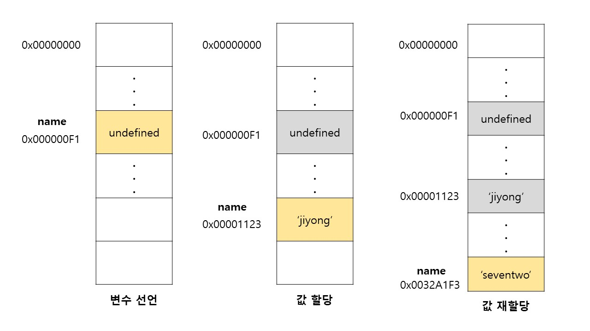

> 이미 값이 할당되어 있는 변수에 새로운 값을 또 다시 할당하는 상황

<br>

```javascript
var name = 'jiyong';
name = 'seventwo';
```

- 재할당은 현재 변수에 저장된 값을 버리고 새로운 값을 저장하는 것이다.
- var 키워드로 선언한 변수는 선언과 동시에 `undefined`로 초기화되기 때문에 **변수에 처음으로 값을 할당하는 것도 재할당이라 할 수 있다.**
  - `원시타입`은 변경이 불가능하므로 재할당을 해야한다.
- 만약 값을 재할당할 수 없다면 변수가 아니라 `상수 (constant)`라 한다.
  - ES6에 도입된 `const` 키워드를 사용해 선언한 변수는 재할당이 금지된다.
- 기존에 저장되어 있던 메모리 공간에서 값을 지우고 새로운 값을 저장하는 것이 아니라 **새로운 메모리 공간을 확보한다.**



- name의 이전 값인 undefined와 'jiyong'은 어떤 변수도 값으로 가지고 있지 않다.
  - 더 이상 필요하지 않다는 것을 의미한다.
- 이런 불필요한 값들은 `가비지 콜렉터 (garbage collector)` 에 의해 메모리에서 자동으로 해제된다.

<br>

## 원시 타입, 객체 타입

> 자바스크립트가 제공하는 7가지 데이터 타입 (숫자, 문자열, 불리언, null, undefined, symbol, 객체 타입)은 크게 원시 타입과 객체 타입으로 구분할 수 있다.

- 원시 값은 변경이 불가능 한 값을 의미한다. (immutable value)
- 객체 타입은 변경 가능한 값이다. (mutable value)
- 원시 값을 변수에 할당하면 메모리에는 실제 값이 저장된다.
- 반대로 객체를 변수에 할당하면 메모리에 참조 값이 저장된다.

**불변성을 갖는 원시 값을 할당한 변수는 재할당 이외에 변수 값을 변경하는 방법이 없다**

<br>

### 가비지 컬렉터와 매니지드 언어

가비지 콜렉터는 애플리케이션이 할당한 메모리 공간을 주기적으로 검사하여 더이상 사용되지 않는 메모리를 해제하는 기능을 말한다.

- 더 이상 사용되지 않는 메모리란 **어떤 변수도 참조하지 않는 메모리 공간을 의미한다.**
- 자바스크립트는 가비지 콜렉터를 내장하고 있는 `매니지드 언어`로서 가비지 콜렉터를 통해 메모리 누수(memory leak) 를 방지한다.

<br>

### managed language와 unmanaged language

> 프로그래밍 언어는 메모리 관리 방식에 따라 분류할 수 있다.

- 언매니지드 언어
  - C 언어 같은 언매니지드 언어는 개발자가 명시적으로 메모리를 할당하고 해제하는 메모리 제어 기능을 제공한다.
  - 최적의 성능을 확보할 수 있지만 반대로 치명적인 오류를 생산할 수 있다.
- 매니지드 언어
  - 개발자의 직접적인 메모리 제어를 허용하지 않는다.
  - 개발을 편하게 할 수 있지만, 반대로 성능 면에서 손실을 감수할 수밖에 없다.
