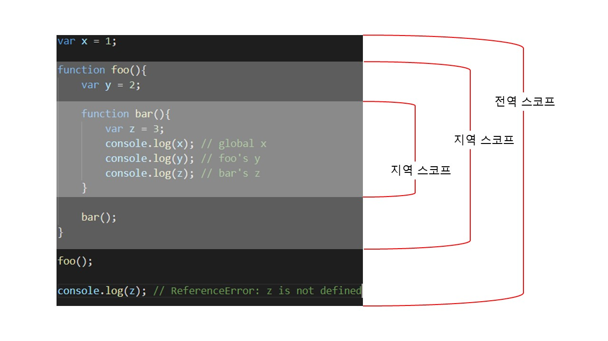
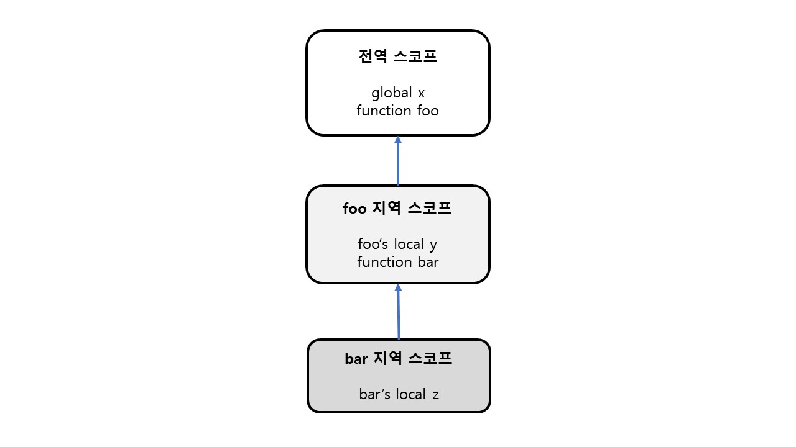

모든 식별자는 자신이 선언된 위치에 의해 다른 코드가 식별자 자신을 참조할 수 있는 유효 범위가 결정된다. 이를 `스코프`라고 한다.

즉, 스코프는 식별자가 유효한 범위를 말한다.

- 함수 내부에서 선언된 변수는 해당 함수 외부에서는 참조할 수 없다.
- 스코프를 통해 변수 이름의 충돌을 방지할 수 있다.
- 스코프라는 개념이 존재하지 않는다면 코드 내부에 변수 이름은 오직 유일해야 한다.
- 우리가 컴퓨터에 파일을 저장할 때, 같은 범위(scope)에서는 같은 이름으로 파일을 저장할 순 없지만 다른 범위(다른 폴더)나 해당 범위 내의 폴더 내(자식 폴더)에는 같은 이름으로 파일을 저장할 수 있는 개념과 비슷하다.

<br>

## var과 let, const

```javascript
function foo() {
  var x = 1;
  // 중복 선언을 허용한다..
  var x = 2;
  console.log(x); //2
}
foo();
```

```javascript
function foo() {
  let x = 1;
  let x = 2; // SyntaxError: Identifier 'x' has already been declared
  console.log(x);
}
foo();
```

- `var` 키워드로 선언된 변수는 같은 스코프 내에서 중복 선언이 허용된다. 이는 의도치 않게 변수 값이 재할당되어 변경되는 부작용을 발생시킨다.
- `let` 이나 `const`로 선언된 변수는 같은 스코프 내에서 중복 선언이 불가하다!

<br>

대부분의 프로그래밍 언어는 함수 몸체만이 아니라 모든 코드 블록이 지역 스코프를 만든다. 이러한 특성을 `블록 레벨 스코프(block level scope)` 라 한다. **하지만 var로 선언된 변수는 오로지 함수 코드 블록만을 지역 스코프로 인정한다.**

하지만 **let, const 키워드는 블록 레벨 스코프를 지원한다**

<br>

### 변수 호이스팅

```javascript
console.log(x); // ReferenceError
let x;
```

var 키워드와 다르게 let 키워드로 선언한 변수는 호이스팅이 발생하지 않는 것 처럼 동작한다.

<br>

사실은 var 키워드로 선언한 변수는 런타임 이전에 `선언 단계`와 `초기화 단계`를 한번에 진행한다.

즉, var 키워드로 선언한 변수는 변수의 존재를 알리는 것과 동시에 `undefined`로 초기화 한다.

그러나 `let` 키워드로 선언한 변수는 선언 단계와 초기화 단계가 분리되어 진행된다. 선언 단계는 런타임 이전에 실행되지만, **초기화 단계는 변수 선언문에 도달했을 때 실행된다.**

```javascript
let x = 1; // 전역 변수

{
  // 지역 변수 x 선언문에 도달하지 않았으므로 초기화 단계가 실행되지 않았다.
  console.log(x); // ReferenceError: Cannot access 'x' before initialization
  let x = 2; // let 키워드로 선언한 변수는 블록 레벨 스코프이므로 지역변수
}
```

<br>

### const 키워드

**const 키워드로 선언한 변수는 선언과 동시에 초기화를 해야한다.**

const도 let과 마찬가지로 블록 레벨 스코프를 가지며, 선언 단계와 초기화 단계가 분리되어 진행된다.

- `const x = 1` 에 도달해야 초기화 단계를 거치게 된다.

<br>const 키워드로 선언한 변수는 재할당이 금지된다. 여기서 주의해야 할 점이 있다.

const 키워드로 선언한 변수의 값이 `원시 타입 (객체 타입이 아닌)`인 경우 값을 변경하려면 `재할당`을 해야한다. 하지만 **객체 타입의 경우 주소 값을 저장하고 있으므로 객체 내의 값을 변경하고자 할때는 재할당이 이루어지지 않는다.** 따라서 객체를 할당한 경우 값을 변경할 수 있다.

**const 키워드는 재할당을 금지할 뿐, 불변을 의미하지 않는다.**

<br>

## 스코프의 종류

> 전역 스코프
>
> 지역 스코프

| 구분 | 설명             | 스코프      | 변수      |
| ---- | ---------------- | ----------- | --------- |
| 전역 | 코드의 바깥 영역 | 전역 스코프 | 전역 변수 |
| 지역 | 함수의 내부      | 지역 스코프 | 지역 변수 |

- 전역 변수는 어디서든지 참조할 수 있다.
- 지역 변수는 자신의 영역 혹은 하위 지역 스코프에서 유효하다.



<br>

## 스코프 체인

모든 스코프는 하나의 계층적 구조로 연결되며, 이렇게 스코프가 계층적으로 연결된 것을 `스코프 체인(scope chain)` 이라고 한다.

변수를 참조할 때 자바스크립트 엔진은 스코프 체인을 통해 해당 스코프에서 시작하여 상위 스코프 방향으로 이동하며 선언된 변수를 검색한다. (identifier resolution)



<br>

스코프 체인은 물리적으로 존재한다. 자바스크립트 엔진은 코드를 실행하기 전에 `렉시컬 환경(Lexical Environment)`을 생성한다.

<br>

## 렉시컬 스코프

- 동적 스코프(dynamic scope) : **함수를 호출하는 시점**에 동적으로 상위 스코프를 결정한다.
- `렉시컬 스코프(Lexical scope)` : **함수를 정의하는 시점**에 따라 상위 스코프를 결정한다. 즉, ㅈ함수의 상위 스코프는 언제나 자신이 정의된 스코프이다.

```javascript
var x = 1;

function foo() {
  var x = 10;
  bar();
}

function bar() {
  console.log(x);
}

foo(); // 1 : foo에서 bar를 실행했지만 bar의 상위 스코프는 전역 스코프
bar(); // 1 : 전역 스코프의 x
```
