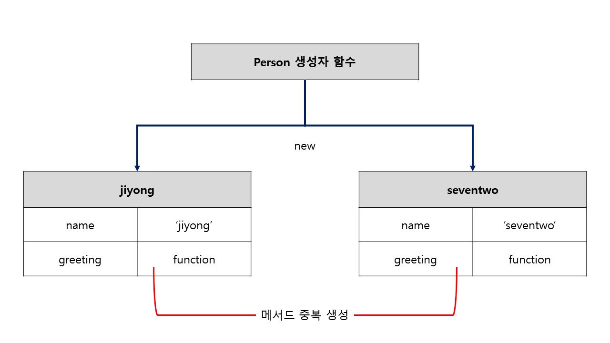
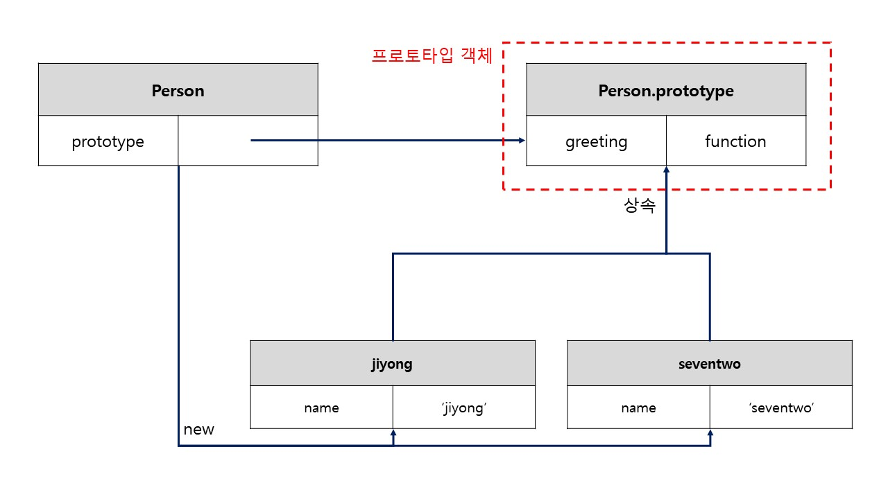

> 자바스크립트는 프로토타입 기반의 객체지향 프로그래밍 언어다.

ES6부터 클래스가 도입되었다. 하지만 ES6의 클래스가 기존 `프로토타입 기반 객체지향 모델`을 없애고 새로운 객체지향 모델을 제공하는 것은 아니다.

하지만 생성자 함수와 정확히 동일하게 동작하지는 않는다. 이는 나중에 `클래스`에서 다루도록 한다.

객체는 **상태 데이터와 동작을 하나의 논리적인 단위로 묶은 복합적인 자료구조**라고 할 수 있다. 이때 객체의 상태 데이터를 `프로퍼티(property)`, 동작을 `메서드(method)`라고 한다.

<br>

자바스크립트는 프로토타입 기반으로 상속을 구현하여 불필요한 중복을 제거한다.

```javascript
function Person(name) {
  this.name = name;
  this.greeting = function () {
    console.log('안녕하세요. 저는 ' + this.name);
  };
}

const jiyong = new Person('jiyong');
const seventwo = new Person('seventwo');
```

생성자 함수는 위와 같이 동일한 프로퍼티 구조를 갖는 객체를 여러 개 생성할 때 매우 유용하다. 하지만 **Person 생성자는 객체를 생성할 때마다 greeting 메서드를 중복 생성하고 모든 인스턴스가 중복 소유한다.**



<br>

자바스크립트는 프로토타입을 기반으로 상속을 구현한다. 상속을 통해 중복을 제거하면 다음과 같다.

```javascript
function Person(name) {
  this.name = name;
}

Person.prototype.greeting = function () {
  console.log('안녕하세요. 저는 ' + this.name);
};
```



greeting 메서드를 하나만 생성하여 Person.prototype의 메서드로 할당하였다. 따라서 Person 생성자가 생성하는 모든 객체들은 greeting 메서드를 상속받아 사용할 수 있다.

<br>

## 프로토타입 객체

`프로토타입` 객체는 객체지향 프로그래밍에서 **상속**을 구현하기 위해 사용된다. 프로토타입은 어떤 객체의 상위 객체의 역할을 하는 객체로서 상속받은 하위 객체는 상위 객체의 프로퍼트를 자신의 프로퍼티처럼 자유롭게 사용할 수 있다.

객체 리터럴에 의해 생성된 객체의 프로토타입은 `Object.prototype`이고 생성자 함수에 의해 생성된 객체의 프로토타입은 생성자 함수의 prototype 프로퍼티에 바인딩되어 있는 객체다.

`__proto__ ` 접근자 프로퍼티 대신 `Object.getPrototyeOf` 메서드와 `Object.setPrototypeOf`메서드를 사용하는 것을 권장한다.

```javascript
const parent = { x: 1 };
const child = {};

Object.setPrototypeOf(child, parent);
console.log(Object.getPrototypeOf(child)); // { x: 1 }

console.log(child.x); // 1
```
