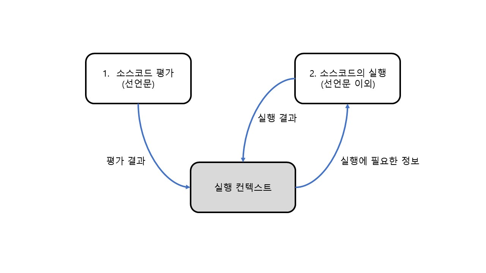
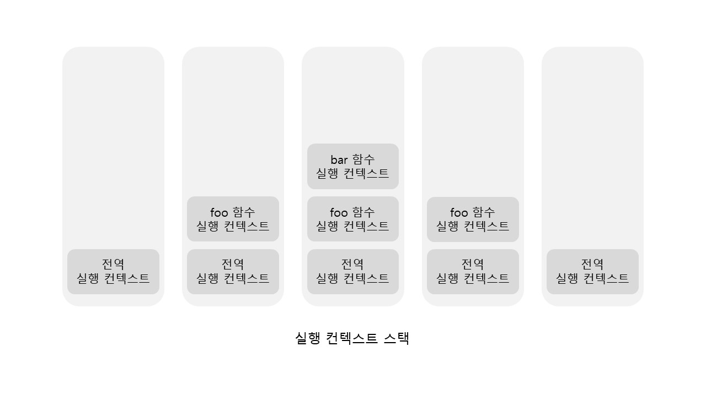
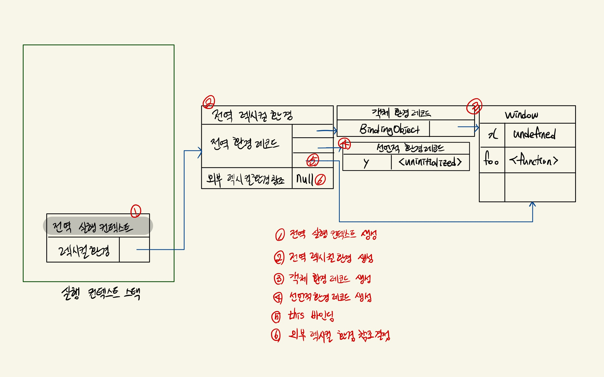
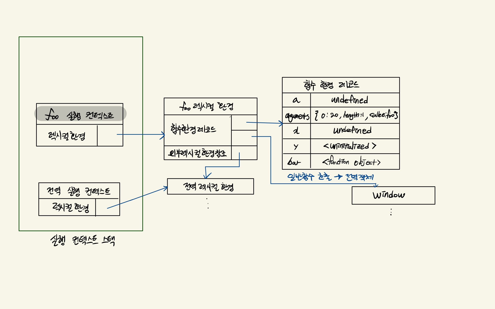

> 실행 컨텍스트(execution context)는 자바스크립트의 동작 원리를 담고 있는 핵심 개념이다.

<br>

## 소스코드의 타입

ECMAScript 사양은 소스코드를 4가지 타입으로 구분한다. 4가지 타입의 소스코드는 실행 컨텍스트를 생성한다.

| 소스코드의 타입 | 설명                                                                                               |
| --------------- | -------------------------------------------------------------------------------------------------- |
| 전역 코드       | 전역에 존재하는 소스코드를 말한다. 전역에 존재하는 함수, 클래스 등의 내부코드는 포함되지 않는다.   |
| 함수 코드       | 함수 내부에 존재하는 소스코드를 말한다. 함수 내부에 중첩된 함수 등의 내부코드는 포함되지 않는다.   |
| eval 코드       | 빌트인 전역 함수인 eval 함수에 인수로 전달되어 실행되는 소스코드를 말한다.                         |
| 모듈 코드       | 모듈 내부에 존재하는 소스코드를 말한다. 모듈 내부의 함수, 클래스 등의 내부 코드는 포함되지 않는다. |

<br>

1. `전역 코드`
   - 전역 코드는 전역 변수를 관리하기 위해 최상위 스코프인 전역 스코프를 생성해야 한다. 그리고 키워드로 선언된 전역 변수와 함수 선언문으로 정의된 전역 함수를 전역 객체의 프로퍼티와 메서드로 바인딩하고 참조하기 위해 전역 객체와 연결되어야 한다. 이를 위해 전역 코드가 평가되면 전역 실행 컨텍스트가 생성된다.
2. `함수 코드`
   - 함수 코드는 지역 스코프를 생성하고 지역 변수, 매개변수, arguments 객체를 관리해야 한다. 그리고 지역 스코프를 전역 스코프에서 시작하는 스코프 체인의 일원으로 연결해야 한다. 이를 위해 함수 코드가 평가되면 실행 컨텍스트가 생성된다.
3. `eval 코드`
   - eval 코드는 strict mode에서 독자적인 스코프를 생성한다. 이를 위해서 eval 코드가 평가되면 eval 실행 컨텍스트가 생성된다.
4. `모듈 코드`
   - 모듈 코드는 모듈별로 독립적인 모듈 스코프를 생성한다. 이를 위해서 모듈 코드가 평가되면 모듈 실행 컨텍스트가 생성된다.

<br>

## 소스코드의 평가와 실행

자바스크립트 엔진은 소스코드를 **2개의 과정 (소스코드의 평가, 소스코드의 실행)**으로 나누어 처리한다.

**소스코드 평가 과정에서 실행 컨텍스트를 생성하고 변수, 함수 등의 선언문만 먼저 실행**하여 생성된 변수나 함수 식별자를 키로 **실행 컨텍스트가 관리하는 스코프에 등록**한다.

이후 소스코드가 실행되기 시작한다. 이때 **소스코드가 필요한 정보(변수, 함수의 참조)를 실행 컨텍스트가 관리하는 스코프에서 취득**한다. 소스코드의 **실행 결과는 다시 실행 컨텍스트가 관리하는 스코프에 등록된다.**



<br>

## 실행 컨텍스트 스택

자바스크립트 엔진은 먼저 전역 코드를 평가하여 전역 실행 컨텍스트를 생성한다. 그리고 함수가 호출되면 함수 코드를 평가하고 함수 실행 컨텍스트를 생성한다.

이때 생성된 실행 컨텍스트는 `stack`자료구조로 관리된다. 이를 **실행 컨텍스트 스택**이라 부른다.

```javascript
const x = 1;

function foo() {
  const y = 2;

  function bar() {
    const z = 3;
    console.log(x + y + z);
  }

  bar();
}

foo(); // 6
```



<br>

## 렉시컬 환경

실행 컨텍스트 스택이 코드의 실행 순서를 관리한다면 렉시컬 환경은 스코프와 식별자를 관리한다.

실행 컨텍스트는 `Lexical Environment` 컴포넌트와 `VariableEnvironment` 컴포넌트로 구성된다.

좀 더 쉬운 설명을 위해 두 컴포넌트를 구분하지 않고 설명한다.

<br>

`렉시컬 환경` 은 두 개의 컴포넌트로 구성된다.

- `EnvironmentRecord`
  - 스코프에 포함된 식별자를 등록하고 식별자에 바인딩된 값을 관리하는 장소다.
- `OuterLexicalEnvironmentReference`
  - 외부 렉시컬 환경에 대한 참조는 상위 스코프를 참조한다. 외부 렉시컬 환경에 대한 참조를 통해 단방향 리스트인 `스코프 체인`을 구현한다.

<br>

밑의 함수의 실행 컨텍스트 생성과 식별자 검색 과정에 대해 알아보자.

```javascript
var x = 1;
const y = 2;

function foo(a) {
  var x = 3;
  const y = 4;

  function bar(b) {
    const z = 5;
    console.log(a + b + x + y + z);
  }

  bar(10);
}

foo(20);
```

<br>

### 전역 코드 평가

1. 전역 실행 컨텍스트 생성
   - 비어있는 전역 실행 컨텍스트를 생성하여 실행 컨택스트 스택에 push 한다.
   - push된 전역 실행 컨텍스트는 스택의 최상위이므로 실행 중인 `실행 컨텍스트 (running execution context)` 가 된다.
2. 전역 렉시컬 환경 생성
   1. 객체 환경 레코드 생성 : var 키워드로 선언한 전역 변수와 함수 선언문으로 정의된 함수는 전역 환경 레코드의 객체 환경 레코드에 연결된 `BindingObject` 를 통해 전역 객체의 프로퍼티와 메서드가 된다.
   2. 선언적 환경 레코드 생성 : var 키워드와 함수 선언문으로 정의한 것 이외 즉, `const`, `let` 키워드로 선언한 전역 변수는 `선언적 환경 레코드`에 등록되고 관리된다.
3. this 바인딩
   - 전역 객체가 바인딩 된다.
4. 외부 렉시컬 환경에 대한 참조 결정
   - 현재 전역 코드가 평가중이므로 스코프 체인에서 상위 스코프가 존재하지 않는다. 따라서 null이 할당된다.
5. 전역 코드 실행
   - 순차적으로 실행되면서 x, y의 값이 할당되고, foo 함수가 호출된다.
   - 일반적으로 실행 중인 실행 컨텍스트의 렉시컬 환경에서 식별자를 검색할 수 없으면 외부 렉시컬 환경에 대한 참조가 가리키는 렉시컬 환경 (상위 스코프)로 이동하며 식별자를 검색한다. 하지만 전역 렉시컬 환경은 스코프 체인의 **종점** 이므로 바로 참조 에러를 발생시킨다.



<br>

### foo 함수 평가

1. 함수 실행 컨텍스트 실행
   - foo 함수 실행 컨텍스트를 생성한다.
   - **함수 렉시컬 환경이 완성된 다음** 실행 컨텍스트 스택에 push 한다.
2. 함수 렉시컬 환경 생성
   - foo 함수 렉시컬 환경을 생성하고 foo 함수 실행 컨텍스트에 바인딩 한다.
3. 함수 환경 레코드 생성
   - 함수 환경 레코드 에서는 매개변수, arguments 객체, 함수 내부에서 선언한 지역 변수와 중첩 함수를 등록 및 관리한다.
4. this 바인딩
   - foo 함수는 일반 함수로 호출되었으므로 this는 전역 객체를 가리킨다.
5. 외부 렉시컬 환경에 대한 참조 결정
   - foo 함수는 전역 코드에 정의된 전역 함수다. 따라서 **foo 함수 정의는 전역 코드 평가 시점에서 평가된다.**
   - 따라서 전역 렉시컬 환경의 참조가 할당된다.
6. foo 함수 실행
   - 런타임이 시작되어 foo 함수가 순차적으로 실행되기 시작한다.
   - 매개변수에 인수가 할당되고, 지역 변수 x, y에 값이 할당된다.
   - 함수 bar가 호출된다.
   - 만약 foo 함수내에서 x, y 를 검색해야 하는 경우가 생긴다면 굳이 상위 스코프를 가지 않더라도 x와 y가 지역변수 내에 선언되었으므로 지역 변수 x, y가 검색될 것이다.



<br>

### bar 함수 평가

> foo와 동일한 과정

<br>

## 실행 컨텍스트와 블록 레벨 스코프

if문과 같은 블록이 실행되면 다음과 같은 작업이 일어난다.

1. Block 렉시컬 환경 생성
   - 최상위 스택의 렉시컬 환경이 Block 렉시컬 환경을 가르킨다.
2. 선언적 환경 레코드 생성
   - 전에 언급한 바와 같이 var 키워드는 함수 레벨 스코프를 따르기 때문에 block은 아무 의미 없다.
   - const, let 키워드로 선언한 변수 등이 해당 필드로 들어가게 될 것이다.
3. 외부 렉시컬 환경 참조
   - 현재 블록문이 실행되기 전의 렉시컬 환경을 참조한다.
