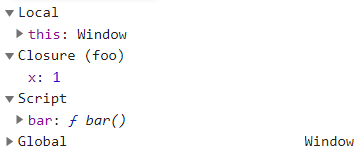

```javascript
const x = 1;

function outer() {
  const x = 10;
  const inner = function () {
    console.log(x);
  };
  return inner;
}

// outer함수를 호출하면 inner 함수가 return 된다.
const innerFunc = outer();
// outer 실행 컨텍스트는 실행 컨텍스트 스택에서 pop 되어진다.
innerFunc(); // 10
```

위와 같이 **외부 함수보다 중첩 함수가 더 오래 유지되는 경우 중첩 함수는 외부 함수의 변수를 참조할 수 있다. 이러한 중첩 함수를 `클로저` 라고 한다.**

핵심은 outer 함수의 실행 컨텍스트가 실행 컨텍스트 스택에서 제거된다고 해도 **outer 함수의 렉시컬 환경까지 소멸하는 것은 아니라는 점이다.**

가비지콜렉터는 더 이상 참조하는 것이 존재하지 않을 때 메모리에서 지운다.

inner function이 outer 렉시컬 환경을 참조하고 있기 때문에 가비지 컬렉션의 대상이 되지 못한다.

<br>

```javascript
function foo() {
  const x = 1;
  const y = 2;

  function bar() {
    const z = 3;
    debugger;
    console.log(z);
  }

  return bar;
}
const bar = foo();
bar();
```

- bar 함수는 상위 스코프(foo)의 어떤 식별자도 참조하고 있지 않다.
- 그러므로 bar 함수는 클로저가 아니다.

<br>

```javascript
function foo() {
  const x = 1;
  const y = 2;

  function bar() {
    debugger;
    // 상위 스코프의 식별자 x를 참조한다.
    console.log(z);
  }

  return bar;
}
const bar = foo();
bar();
```

- bar 함수는 상위 스코프의 x를 참조하고 있다.
- 또한, 외부 함수보다 더 오래 유지되고 있다.
  - **외부 함수보다 더 오래 유지되지 않을 경우 일반적으로 클로저라고 하지 않는다.**

위의 코드를 chrome 개발자 도구로 보면 다음과 같이 나온다.



<br>

## 클로저의 활용

> **클로저는 상태를 안전하게 변경하고 은닉하기 위해서 사용한다.**

```javascript
let num = 0;

const increase = function () {
  return ++num;
};

increase();
```

- 위의 코드는 잘 동작 하지만, num을 increase 함수 호출 이외의 방법으로도 변경할 수 있다.

<br>

```javascript
const outer = function () {
  let num = 0;

  // 클로저
  function increase() {
    return ++num;
  }

  return increase;
};

increase = outer();

console.log(increase());
console.log(increase());
```

- 위의 코드를 실행하면 전역 변수인 increase에 outer가 반환하는 increase 함수가 반환된다.
- num은 외부에서 직접 접근이 불가능한 `private` 변수이다.
- 또한 outer를 한번 실행했으므로, num이 초기화 되지 않을 것이다.
