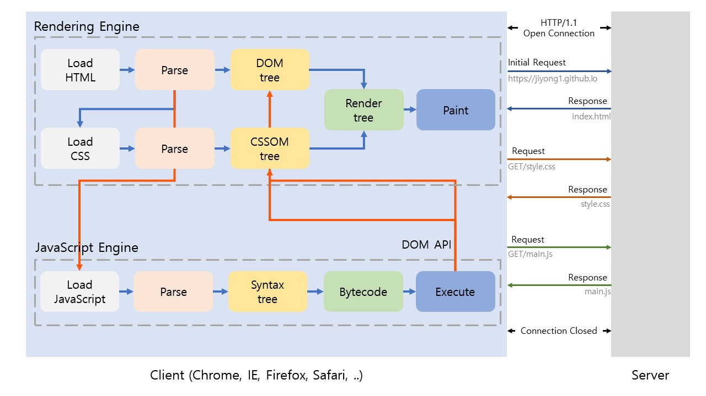
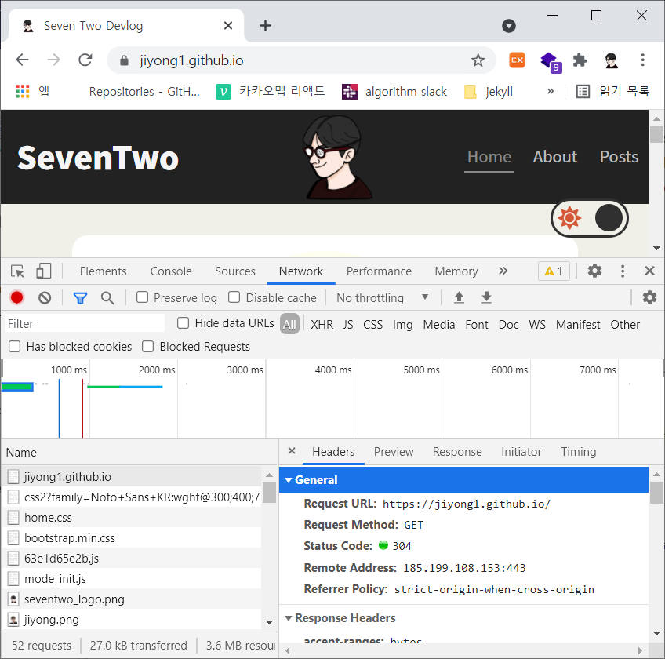

> 브라우저가 HTML, CSS, 자바스크립트로 작성된 텍스트 문서를 어떻게 파싱하여 브라우저에 렌더링하는지 알아보자.

브라우저는 다음 과정을 통해 렌더링을 수행한다.

 

1. HTML, CSS, 자바스크립트, 이미지, 폰트 파일 등 렌더링에 필요한 리소스를 요청하고 서버로부터 응답을 받는다.
2. 브라우저의 렌더링 엔진은 응답된 HTML, CSS를 파싱하여 `DOM`과 `CSSOM`을 생성하고 이들을 결합하여 `Render Tree`를 생성한다.
3. 브라우저의 자바스크립트 엔진은 응답된 자바스크립트를 파싱하여 `AST(Abstract Syntax Tree)`를 생성하고 바이트코드로 변환하여 실행한다. 이때 자바스크립트는 DOM API를 통해 DOM이나 CSSOM을 변경할 수 있다. 변경된 DOM과 CSSOM은 다시 Render Tree로 결합된다.
4. 렌더 트리를 기반으로 HTML 요소의 레이아웃을 계산하고 브라우저 화면에 HTML 요소를 페인팅한다.

 

## 1. 요청과 응답

브라우저의 핵심적인 기능은 **필요한 리소스를 서버에게 요청하고 응답받아 브라우저에 시각적으로 렌더링하는 것이다.**

서버에 요청을 전송하기 위해 브라우저는 주소창을 제공한다. 브라우저 주소창에 URL을 입력하고 요청하면 URL의 호스트 이름이 DNS를 통해 IP 주소로 변환되고 해당 IP 주소를 갖는 서버에게 요청을 전송한다.

요청과 응답은 개발자 도구의 `Network` 패널에서 확인할 수 있다. 브라우저 창에 블로그 주소인 [https://jiyong1.github.io](https://jiyong1.github.io) 를 입력하고 엔터 키를 눌러 요청을 전송 하면 다음 그림과 같이 요청 내용과 응답한 내용을 Network 패널에서 확인할 수 있다.

 

 

위 그림을 보면 html 뿐만 아니라 CSS, 자바스크립트,이미지, 폰트 파일들도 응답되는 것을 알 수 있다.

**브라우저 렌더링 엔진이 HTML을 파싱하는 과정에서 다른 리소스를 로드하는 태그를 만나면 HTML 파싱을 일시 중단하고 해당 리소스 파일을 서버로 요청**하기 때문이다.

 

## 2. HTTP 1.1과 HTTP 2.0

HTTP는 웹에서 브라우저와 서버가 통신하기 위한 프로토콜이다.

`HTTP/1.1`은 기본적으로 커넥션당 하나의 요청과 응답만 처리한다. 즉, 여러 개의 요청을 한번에 전송할 수 없고 응답 또한 마찬가지이다. 따라서 HTML문서에 내에 외부 리소스를 로드하는 태그를 하나하나 개별적으로 요청하고 응답받기 때문에 요청할 리소스의 개수에 비례하여 응답시간도 증가한다.

`HTTP/2`는 HTTP/1.1과 다르게 커넥션당 여러 개의 요처과 응답이 가능하다. 따라서 여러 리소스의 동시 전송이 가능하므로 HTTP/1.1에 비해 페이지 로드 속도가 약 50% 정도 빠르다고 알려져 있다.

 

## 3. HTML 파싱과 DOM 생성

브라우저의 요청에 의해 서버가 응답한 HTML 문서는 **문자열로 이루어진 텍스트**이다. 이러한 텍스트를 브라우저에 시각적으로 렌더링하려면 브라우저가 이해할 수 있는 자료구조로 변환하여야 한다.

브라우저 렌더링 엔진은 응답받은 HTML 문서를 **파싱(바이트 -> 문자 -> 토큰 -> 노드 -> DOM)** 하여 브라우저가 이해할 수 있는 자료구조인 `DOM (Document Object Model)`을 생성한다.

 

## 4. CSS 파싱과 CSSOM 생성

브라우저 렌더링 엔진은 HTML을 한 줄씩 순차적을 파싱하여 DOM을 생성해 나간다. DOM을 생성해 나가다가 **CSS 로드하는 link 태그나 style 태그를 만나면 DOM 생성을 일시 중단한다.**

그리고 link 태그의 href 어트리뷰트에 지정된 CSS 파일을 서버에 요청하여 로드한 CSS 파일이나 style 태그 내에 CSS를 **파싱 과정(바이트 -> 문자 -> 토큰 -> 노드 -> CSSOM)** 을 거치며 해석하여 `CSSOM (CSS Object Model)`을 생성한다. 이후 CSS 파싱을 완료하면 다시 HTML 파싱이 중단된 지점부터 다시 HTML을 파싱하기 시작하여 DOM 생성을 재개한다.

 

## 5. 렌더 트리 생성

HTML과 CSS를 파싱하여 각각 **DOM과 CSSOM**을 생성한 후, 렌더링을 위해 `렌더 트리(Render Tree)` 로 결합한다.

렌더 트리는 렌더링을 위한 트리 구조의 자료구조이다. 따라서 브라우저 화면에 렌더링되지 않는 노드 (script 태그, meta 태그 등)와 CSS에 의해 비표시 (display: none;)되는 노드들은 포함되지 않는다. 다시 말해 렌더 트리는 브라우저 화면에 렌더링 되는 노드만으로 구성된다.

이후 완성된 렌더 트리는 각 HTML 요소의 레이아웃을 계산하는 데 사용되며 브라우저 화면에 픽셀을 렌더링 하는 **페인팅 처리**에 입력된다.

 

## 6. 자바스크립트 파싱과 실행

CSS 파싱과 마찬가지로 HTML을 한 줄씩 순차적으로 파싱하며 DOM을 생성해 나가다가 자바스크립트 파일을 로드하는 script 태그나 자바스크립트 코드를 콘텐츠로 담은 script 태그를 만나면 DOM 생성을 일시 중단한다.

이후 자바스크립트 코드를 파싱하기 위해 **자바스크립트 엔진에 제어권을 넘긴다.** 자바스크립트 파싱과 실행이 종료되면 렌더링 엔진으로 다시 제어권을 넘겨 HTML 파싱이 중단된 지점부터 다시 HTML 파싱을 시작하여 DOM 생성을 재개한다.

자바스크립트 엔진은 자바스크립트 코드를 파싱하여 CPU가 이해할 수 있는 low-level language로 변환하고 실행하는 역할을 한다. 자바스크립트 엔진은 구글 크롬과 Node.js의 V8, 파이어폭스의 SpiderMonkey, 사파리의 JavaScriptCore 등 다양한 종류가 있으며, 위의 모든 자바스크립트 엔진은 ECMAScript 사양을 준수한다.

자바스크립트 엔즌은 자바스크립트 코드를 해석하여 `AST(Abstract Syntax Tree)` 를 생성한다. 그리고 AST를 기반으로 인터프리터가 실행할 수 있는 중간 코드인 바이트코드를 생성하여 실행한다.

 

## 7. 리플로우와 리페인트

만약 자바스크립트 코드에 DOM이나 CSSOM을 변경하는 `DOM API`가 사용된 경우 DOM이나 CSSOM이 변경된다. 이때 변경된 DOM과 CSSOM은 다시 렌더 트리로 결합되고 변경된 렌더 트리를 기반으로 레이아웃과 페인트 과정을 거쳐 브라우저 화면에 다시 렌더링 된다. 이를 **리플로우, 리페인트**라 한다.

- `리플로우` : 레이아웃 계산을 다시 하는 것을 말하며, 노드 추가/삭제, 요소의 크기/위치 변경, 윈도우 리사이징 등 레이아웃에 영향을 주는 변경이 발생한 경우에 한하여 실행된다.
- `리페인트` : 재결합된 렌더 트리를 기반으로 다시 페인트 하는 것을 의미한다.

리플로우와 리페인트는 반드시 순차적으로 동시에 실행되지 않는다. 레이아웃에 영향이 없는 변경은 리플로우 없이 리페인트만 실행된다.

 

## 8. 자바스크립트 파싱에 의한 HTML 파싱 중단

브라우저는 순차적으로 위에서 아래 방향으로 파싱하고 실행한다. 따라서 script 태그의 위치는 중요한 의미를 갖는다.

만약 DOM API를 사용하여 DOM에서 특정한 요소를 취득하려고 하였으나 **script 태그가 해당 HTML 요소가 파싱되기 이전에 위치하였다면** 정상적으로 작동하지 않을 것이다.

이러한 문제를 회피하기 위해 body 요소의 가장 아래에 자바스크립트를 위치시키는 경우가 많다.

 

## 9. script 태그의 async/defer 어트리뷰트

자바스크립트 파싱에 의한 DOM 생성이 중단되는 문제를 해결하기 위해 HTML5 부터 script 태그에 `async`와 `defer` 어트리뷰트가 추가되었다.

async와 defer 어트리뷰트는 src 어트리뷰트를 통해 외부 파일을 로드하는 경우에만 사용할 수 있다.

 

### async 어트리뷰트

HTML 파싱과 외부 자바스크립트 파일의 로드가 비동기적으로 동시에 진행된다. 단, 자바스크립트 파싱과 실행은 자바스크립트 파일의 로드가 완료된 직후 진행되며, 이때 HTML 파싱이 중단된다.

만약 여러 개의 script 태그에 async 어트리뷰트를 지정하면 script태그의 순서와 상관없이 로드가 완료된 자바스크립트부터 먼저 실행되므로 **순서가 보장되지 않는다.**

 

### defer 어트리뷰트

async 어트리뷰트와 마찬가지로 자바스크립트 파일의 로드가 비동기적으로 동시에 진행된다. 하지만 async와 다르게 자바스크립트 파싱과 실행은 HTML 파싱이 완료된 직후, 즉 **DOM 생성이 완료된 직후 실행된다.**
