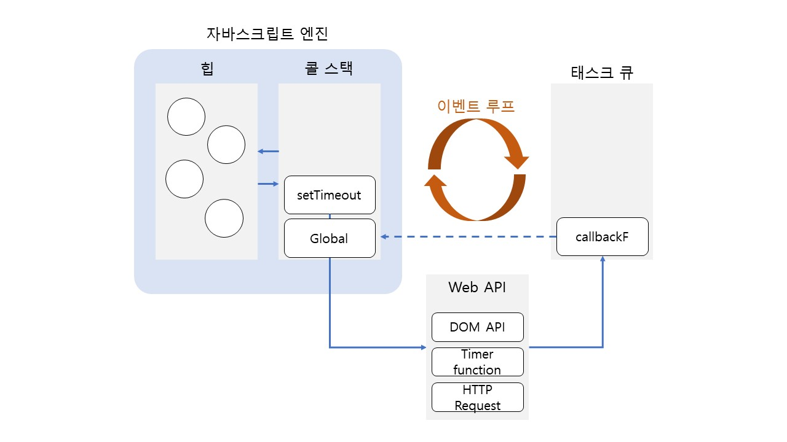

자바스크립트 엔진은 **단 하나의 실행 컨텍스트 스택(콜 스택)** 을 갖는다. 즉, 동시에 2개 이상의 함수를 실행할 수 없다는 뜻이다. 이처럼 자바스크립트엔진은 한 번에 하나의 일만 수행할 수 있는 **싱글 스레드 (single thread) 방식으로 동작한다.** 싱글스레드 방식은 한 번에 하나의 일만 수행할 수 있기 때문에 하나의 일이 어느정도 시간이 걸리는 경우 **블로킹 (blocking)** 이 발생한다.

**비동기(asynchronous) 처리**는 위에서 언급한 블로킹을 방지하기 위해 사용하는 방식으로 현재 실행 중인 태스크가 종료되지 않은 상태라 하더라도 다음 일을 수행한다.

- `동기 처리`
  - 일을 순서대로 처리하므로 **실행 순서가 보장된다는 장점**이 있다.
  - 앞선 일의 수행이 완료될 때까지 **미래의 일들이 블로킹 되는 단점**이 있다.
- `비동기 처리`
  - **현재 실행 중인 일이 종료되지 않더라도 미래의 일을 곧바로 실행**하므로 블로킹이 일어나지 않는다.
  - **실행 순서가 보장되지 않는 단점**이 있다.

 

`setTimeout`, `setInterval`, `HTTP 요청`, `이벤트 핸들러`는 비동기 처리 방식으로 동작한다.

 

## 1. Event Loop와 Task Queue

브라우저가 동작하는 것을 살펴보면 많은 일이 **동시적으로** 처리되는 것처럼 느껴진다. 하지만 위에서 언급한 것과 같이 자바스크립트는 싱글 스레드 방식으로 한 번에 하나의 일만 처리할 수 있다.

자바스크립트의 **동시성 (Concurrency)** 을 지원하는 것이 바로 `Event Loop`이다.

이벤트 루프는 브라우저에 내장되어 있는 기능 중 하나이다.

브라우저 환경을 그림으로 표현하면 다음과 같다.

 

자바스크립트 엔진은 크게 2개의 영역으로 구분할 수 있다.

- 콜 스택
  - 이전에 정리한 내용으로 소스코드 평가 과정에서 생성된 실행 컨텍스트가 추가되고 제거되는 스택 (LIFO) 자료구조인 실행 컨텍스트 스택이 콜 스택이다.
- 힙
  - 힙은 객체가 저장되는 메모리 공간이다. 실행 컨텍스트는 힙에 저장되어 있는 객체를 참조한다.
  - 객체는 원시 값과 다르게 크기가 정해져 있지 않기 때문에 할당해야 할 메모리 공간의 크기를 런타임에 결정해야 한다. 따라서 힙은 구조화 되어 있지 않다는 특징이 있다.

 

위와 같이 자바스크립트 엔진은 단순하게 일을 요청하면 콜 스택을 통해 요청된 작업을 순차적으로 수행할 뿐이다. 따라서 **비동기 처리에서 코드 평가와 실행을 제외한 다른 모든 처리는 자바스크립트 엔진을 구동하는 환경인 브라우저 혹은 Node.js가 담당한다.**

- 태스크 큐

  - 비동기 함수의 콜백 함수 또는 이벤트 핸들러가 일시적으로 보관되는 영역이다.

- 이벤트 루프

  - 콜 스택에 현재 실행 중인 실행 컨텍스트가 있는지, 태스크 큐에 대기 중인 함수가 있는지 계속해서 확인한다. 그리고 **만약 콜 스택이 비어 있는데 태스크 큐에서 대기 중인 함수가 있다면 이벤트 루프는 순차적으로 (큐는 FIFO) 대기 중인 함수를 콜 스택으로 이동시킨다.**
