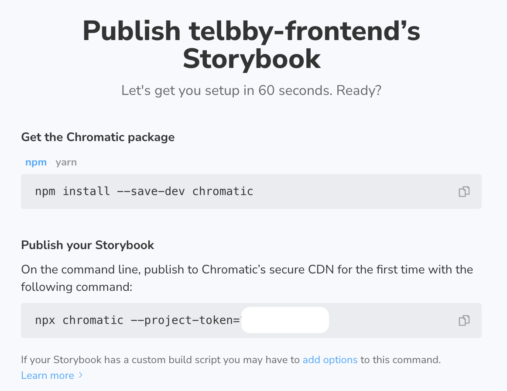
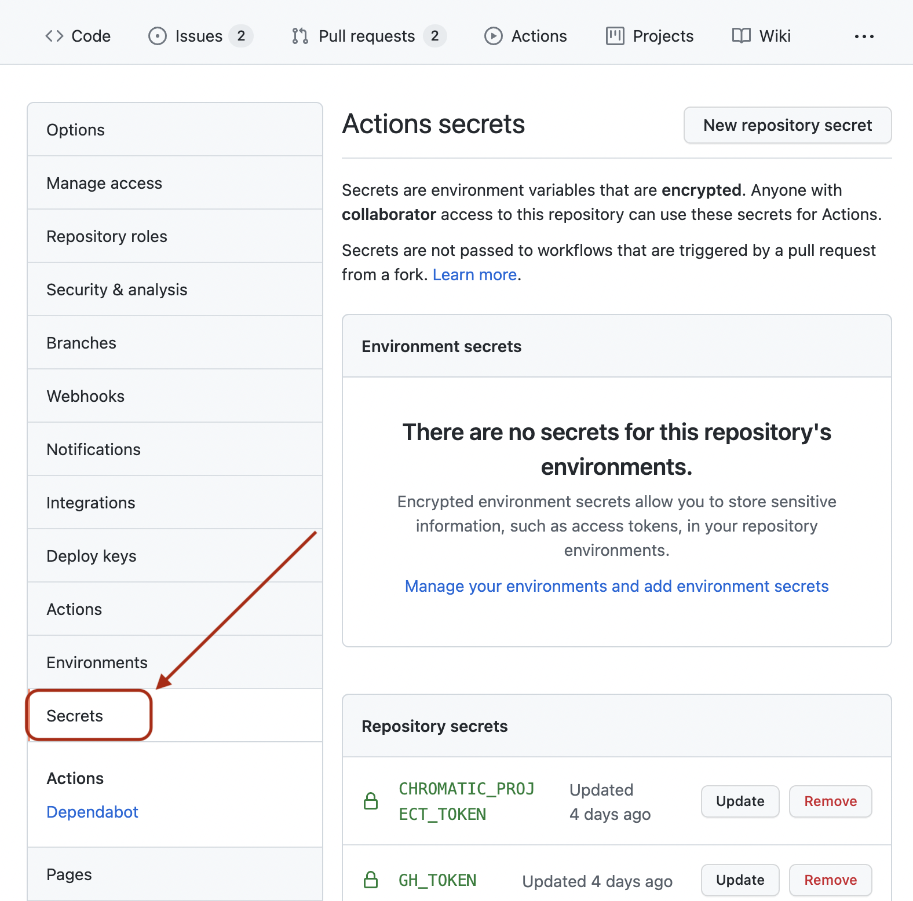
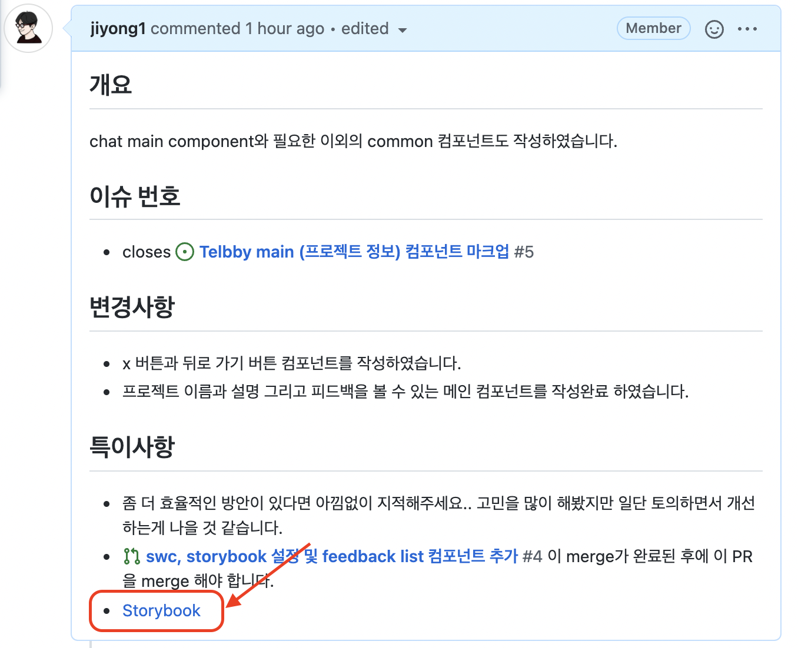

> UI Development Tool

`Storybook` 은 UI 개발 툴로 컴포넌트를 하나씩 렌더링 시킴으로써 개발을 더 쉽고 빠르게 도와주는 도구이다.

`Storybook` 를 사용함으로써 재사용 가능한 컴포넌트들을 시각적으로 테스트해보고, 버그를 사전에 방지할 수 있다.

<br>

## ⭐️ Install Storybook

```bash
$ npx sb init
```

- sb init은 비어있는 프로젝트에서 사용하는 것이 아니다.
- 이렇게 사용하면 내부적으로 **tranpiler**로 `babel` 을 사용하는 것 같다. 번들링은 당연하게 `webpack`을 사용한다.
- 팀의 프로젝트 웹팩 환경 설정과 동일한 환경 customize를 진행하고자 했으나, 위의 방식으로 init 을 하게되면 webpack 4버전을 사용하고 있어 오류가 발생하게 된다.

<br>

- webpack 5버전으로 storybook 환경 구성

```bash
$ npx sb init --builder webpack5
```

<br>

---

<br>

## 🔧 Storybook Webpack configuration

각 확장자 별 로더를 팀이 설정한 로더로 사용하기 위해서 `.storybook/main.js` 파일에 다음의 코드를 추가했다.

- swc-loader 등의 설정을 사용하기 위해 팀의 webpack config 파일을 가져온다.
- alias, rules를 팀의 설정으로 변경한다.

```javascript
const custom = require('../config/webpack/webpack.common');

module.exports = {
  // ... addons, stories, framework, ...
  webpackFinal: async (config) => {
    const {
      module: { rules },
      resolve: { alias },
    } = custom;

    return {
      ...config,
      module: { ...config.module, rules },
      resolve: {
        ...config.resolve,
        alias,
      },
    };
  },
};
```

<br>

---

<br>

## 💈 Decorators

`emotion` , `styled-components` 를 사용하면 몇 가지 theme을 전달받아 사용할 수 있는데, storybook 에서도 이 같은 것들을 전달받기 위해 **decorators** 를 설정하여야 한다.

```jsx
// .storybook/preview.js
export const decorators = [
  (Story) => (
    <RecoilRoot>
      <ThemeProvider theme={theme}>
        <GlobalStyle />
        <Story />
      </ThemeProvider>
    </RecoilRoot>
  ),
];
```

<br>

위의 데코레이터는 앞으로 작성할 **모든 스토리에 적용된다.** 이외에도 **스토리북 템플릿**, 혹은 **로컬 스토리북** 에도 데코레이터를 달아서 스타일을 적용하는 등의 기능을 구현할 수 있다.

```tsx
// 아래의 데코레이터는 파일 내의 모든 스토리에 적용된다.
export default {
  title: 'My Story',
  component: MyStory,
  decorators: [
    (Story) => (
      <div
        style={{
          width: '400px',
          backgroundColor: 'black',
          padding: '1rem',
        }}
      >
        <Story />
      </div>
    ),
  ],
} as ComponentMeta<typeof MyStory>;


const Template: ComponentStory<typeof MyStory> = (args) => (
  <MyStory {...args} />
);

const base = Template.bind({});
base.args = {
  isBgBlack: true
}

// 아래의 데코레이터는 로컬 데코레이터로 아래의 스토리에만 적용된다.
const backgroundWhite = Template.bind({});
base.args = {
  isBgBlack: false,
}
base.decorators = [
  (Story) => {
    return (
      <div style={{ backgroundColor: 'white' }}>
        <Story />
      </div>
    );
  },
}]
```

직접 실험해보지는 않았지만 조사해본 결과 마치 `CSS 우선순위` 처럼 **local > Template > preview** 으로 우선순위가 local이 가장 높다고 한다.

<br>

---

<br>

## 📐 Controls

상태 혹은 Props의 변경에 따라서 UI 상태가 어떻게 바뀌는지 확인하기 위해 이제까지 vscode를 들어가서 코드 수정하고.. 다시 확인하고.. 이 같은 과정을 매일 반복했다.

**Controls** 는 코드를 직접 변경하지 않아도 Storybook에서 바꿔가며 확인할 수 있는 기능이다.

이보다 더 강력한 점은 **데이터 타입과 해당 타입을 가진 속성** 을 입력한다면 손쉽게 지정한 타입내에서 값을 변경하여 즉각적으로 UI를 확인할 수 있다는 점이다. 속성 설정은 다음과 같다.

```javascript
// Button.stories.js|jsx|ts|tsx

import { Button } from './Button';

export default {
  title: 'Button',
  component: Button,
  argTypes: {
    variant: {
      options: ['primary', 'secondary'],
      control: { type: 'radio' },
    },
  },
};
```

이렇게 작성하면 버튼의 `variant` 속성을 primary와 secondary 중 하나만 선택할 수 있도록 radio 버튼을 controls에서 제공한다.

<br>

또한 `preview.js` 에서는 다음과 같은 코드를 볼 수 있다.

```javascript
export const parameters = {
  controls: {
    matchers: {
      color: /(background|color)$/i,
      date: /Date$/,
    },
  },
};
```

이 덕분에 아래와 같은 방식으로 색을 변경시켜보며 즉각적으로 UI를 확인할 수 있다.


<br>

---

<br>

## 📝 Storybook 작성해보기

```typescript
import React from 'react';
import { ComponentStory, ComponentMeta } from '@storybook/react';
import MyComponent from '@/components/MyComponent';

export default {
  title: 'Path/To/MyComponent',
  component: MyComponent,
} as ComponentMeta<typeof MyComponent>;

const Template: ComponentStory<typeof MyComponent> = (args) => <MyComponent {...args} />;

export const Basic = Template.bind({});
Basic.args = {
  value: 'basic',
};
export const WithProp = Template.bind({});
WithProp.args = {
  value: 'prop',
};
```

- `export default` : 어떤 컴포넌트의 Story인지 작성
  - title : `/` 를 통해 계층을 구분할 수있다. 예를 들어 `common/` 으로 시작하는 story는 `common` 계층 아래에 속하게 된다.
  - decorators, parameters, args 등은 파일내의 아래의 모든 스토리에 적용된다.
- 아래의 Basic, WithProp 등의 **로컬 단계 스토리**에도 decorators 등의 속성을 따로 설정할 수 있다.

<br>

---

<br>

## 🔗 Addons

`addons` 라는 plugin 시스템이 있습니다. 자체적으로 지원하는 addon 이외에도 addon을 설정하여 추가 기능을 사용할 수 있다.

아직은 사용할 일이 없어 찾아보지는 않았지만, react-router 등의 기능을 지원하는 addon도 존재한다고 한다. 🤯

<br>

---

<br>

## 🖥 Chromatic Deployment

> [공식문서](https://storybook.js.org/tutorials/intro-to-storybook/react/ko/deploy/)

Storybook을 사용하면서 팀원과 개발할 때 UI의 결과를 보여주기 위해서 Storybook을 빌드하여 배포하면 코드 리뷰 하는 과정에서 많은 이점을 얻을 것이라고 생각했다. 그래서 배포에 관해 알아보는 과정에서 `Chromatic` 이라는 서비스를 알게 되었다. 🧐

자동 배포를 위해 `Github Actions` 를 이용하였다.

[Chromatic에 로그인](https://www.chromatic.com/start) 을 하고 github repo와 동기화를 한다. 그럼 다음과 같은 화면이 나오게 될 것이다.



여기서 중요한 점은 `--project-token` 뒤에 나와있는 값이다. 이 후 Github Actions에 사용될 토큰이다.

해보지는 않았지만 자동 배포가 아닌 수동으로 위의 command line을 입력하여 배포할 수 있다고 한다.

<br>

### Github 액션 추가하기

`Github Acitions` 를 이용하기 위해 프로젝트 `.github/workflows` 디렉토리 내에 **chromatic.yml** 을 추가하였다.

```yaml
# .github/workflows/chromatic.yml

# Workflow name
name: 'Chromatic Deployment'

# Event for the workflow
on: push

# List of jobs
jobs:
  test:
    runs-on: ubuntu-latest
    steps:
      - uses: actions/checkout@v1
      - run: yarn
      - uses: chromaui/action@v1
        with:
          projectToken: ${{ secrets.CHROMATIC_PROJECT_TOKEN }}
          token: ${{ secrets.GH_TOKEN }}
```

<br>

secrets 를 이용하여 환경 변수를 사용하고 있기 때문에 프로젝트 secrets에 위의 토큰들을 등록해주어야 한다. 사용하는 프로젝트 repo의 settings로 들어가서 등록할 수 있다.



공식 문서에는 `GITHUB_TOKEN` 으로 네이밍이 되어있는데 이제 GITHUB\_ 로 시작하는 환경 변수는 사용할 수 없는 것 같다.

<br>

이제 push를 해보면 배포된 storybook을 chromatic을 통해 확인해볼 수 있다.

배포된 url을 PR에서 공유해 코드를 리뷰하는 팀원이 해당 브랜치를 pull 받아서 실행해보지 않고도 UI를 확인해볼 수 있게 되었다. 😙


