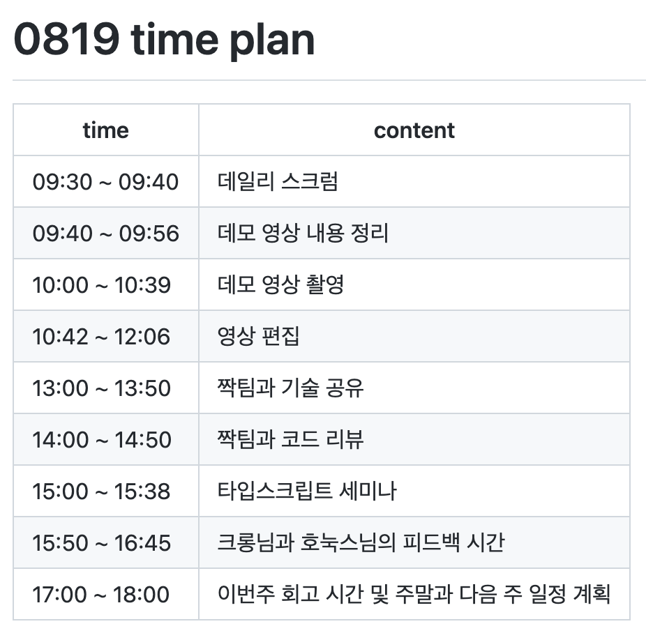

두 달간 정말 바쁘게 살아온 **우아한 테크캠프 4기 과정**에 대해 뒤늦게나마 회고 해보고자 합니다 !

이 글을 보는 분들이 캠프를 참여하고자 하거나, 혹은 캠프를 참여하기로 예정되어 있다면 이 글이 도움이 될 것이라고 생각합니다.. 그리고 제 자신에게도 이 회고는 다시 한번 저를 생각하게 될 계기가 될 것이라고 생각하구요 😄

캠프 과정에 스포(?)될만한 내용은 최대한 자제하도록 하겠습니다 ! 😅

 

## 🥺 캠프에 지원하기 까지

저는 **비전공자** 출신입니다 !

학부 생활하면서 C와 Python을 주로 다뤄보면서 '개발을 해보고 싶다' 라는 생각을 시작으로 2021년 1월 **삼성 청년 SW 아카데미**를 통해 웹 개발을 처음 접해봤습니다. 공부를 하다보니 웹 개발이 너무 재밌는 것 같고, 개발 공부를 하면서도 힘들다는 생각보다는 더 배우고 싶다(?) 라는 생각이 먼저 들었습니다. 그렇게 매일 매일 기술적 성장을 위해 정말 SSAFY 1학기 동안 수험생처럼 (개발, 밥, 잠을 반복..) 공부했습니다 🤯

그렇게 SSAFY 1학기가 마무리 되가고 있던 시점에 **우아한 테크캠프 4기** 모집 공고를 보게 되었습니다. 6개월 밖에 공부를 하지 않았지만, 이때는 자신감이 정말 높았던 시절이라 (더닝 크루거 곡선의 꼭대기).. 과제 테스트이나, 코딩 테스트를 충분히 통과할 수 있을거라고 생각했습니다. 그래서 망설임 없이 **일단 부딪쳐보자!!** 라는 생각을 가지고 지원하게 됐습니다..

> SSAFY 1학기가 끝난 시점의 나..

 

처음 지원을 했을 때는 당연히 우아한형제들이라는 좋은 회사에 입사하는 것이 목표.. 아니 그것만이 목표였습니다. 주변 친구들이 하나 둘씩 취업을 하고 있던 시점이었기 때문에 저 또한 빠르게 취직하고 싶은 생각이 강해서 입사만을 생각하며 지원하고 기대했던 것 같습니다. 하지만 캠프를 진행하면서 저의 이 생각은 바뀌게 되었죠.. 😂

 

---

 

## 🧑‍💻 우아한 테크캠프의 팀 프로젝트

캠프를 진행하면서 **두 달동안 무려 4번의 프로젝트**를 다른 팀원 분들과 함께 진행하였습니다. 첫번째 1주동안 진행했던 간단한 프로젝트를 제외하고는 프로젝트 기간동안 정말 바쁘게 지냈습니다. 아무리 자신이 개발 경험이 풍부하더라도 프로젝트 진행중에는 분명 **도전적인 문제**가 몇 개씩 있기 때문에 캠프에 참여했던 모든 분들이 바쁘게 지내셨을 거라고 생각합니다 ㅎㅎ.. 아래는 **마지막 프로젝트가 마무리 되고 우리 팀의 회고를 노션에 정리한 내용**입니다. 내용을 보시면 힘들었던 프로젝트 과정이 조금이나마 느껴지실 겁니다..😅

> 마지막 프로젝트에서 우리 팀의 회고.. (시간이 없다, 빡세다 등등..)
>
> [노션 링크](https://stump-hovercraft-c9f.notion.site/1-6ec1dda7b5ae4299944d7c81352b0d03)

 

캠프에 들어와서 여러 분들과 함께 팀으로서 개발해보고, 스크럼을 진행해보면서 정말 제가 기술적으로, 그리고 협업을 하는데에 있어 부족한 개발자라는 것을 많이 느꼈습니다. 그러면서 자연스레 입사만을 바라보면서 캠프 생활을 하지 말고, **나의 성장을 위해서 캠프 생활을 하자..!** 라는 생각을 가지게 되었습니다. 🧐

 

### 기술적인 성장

성장의 크기는 **개인적인 경험에 따라 상대적**이라고 생각합니다. 이 말은 즉, '이게 성장이 맞아? 얼마나 경험이 부족했으면..' 이라고 생각하실 수 있다는 의미입니다.. 실제로 캠프에 같이 참여하셨던 고수 동기분은 **'프론트엔드 개발자로서 기술적으로 성장했는지는 솔직히 모르겠다.'** 라고 말씀하시기도 했습니다. 후덜덜.. 그래도 저는 성장했습니다 ! 분명히요 !

서론이 길었고, 어떤 부분에서 기술적으로 성장하였는지에 대해 정리해보았습니다.

 

1. `JavaScript / TypeScript`

   프론트엔드 개발자라면 빠질 수 없는 기술이죠.. 사실 캠프 참여하기 이전에 Modern JavaScript Deep Dive라는 책을 정독한 적이 있어서 이론적으로는 학습이 되어있는 상태였습니다만, 프로젝트를 통한 경험적인 측면은 조금 부족한 상태였습니다.

   2, 3번째 프로젝트에서는 SPA를 구현하기 위해 각종 라이브러리 및 프레임워크 (React, Vue.js 등등..)을 사용하지 않고, 순수 자바스크립트 혹은 타입스크립트를 이용해서 SPA를 구현해야 했습니다.

   SPA 구현을 위해 `history API`를 이용해서 Client Router를 구현해보기도 했고, 컴포넌트 단위로 개발하기 위해 **추상화된 클래스**를 개발하기도 하였으며, 중앙 상태 관리를 위해서 **클로저** 를 통해 상태를 은닉하여 관리하는 등의 여러가지 경험을 할 수 있었습니다.

 

2. `React`

   `Vue.js`를 이용하여 **영화 리뷰 커뮤니티 서비스** 개발한 경험이 있었으나, `React`는 이론만 살짝 공부해보고, 프로젝트 경험을 해본적은 없었습니다.

   하지만, 이번 우아한 테크캠프 마지막 프로젝트 **배민 문방구** 개발에서 `React` 라이브러리를 사용하여 개발을 진행하면서 `React` 사용에 있어 자신감을 얻게 되었습니다.

   CSS-in-JS 라이브러리 `styled-components`를 사용해보았으며, 상태 관리를 **서버 상태를 그대로 반영한다.** 라는 팀의 생각으로 `react-query` 라는 라이브러리만을 사용하여 상태를 관리하였습니다. (Client 상태가 필요하다면 `Context API` 를 사용하였고, 최대한 사용하지 않으려고 노력했습니다)

 

3. `Webpack 등의 설정`

   최신 자바스크립트 개발에서 **모듈**이라는 개념은 빠질 수 없는 중요한 요소입니다. 그러면서 `Webpack`과 같은 번들러의 역할도 중요해졌죠.

   3번의 프로젝트에서 직접 배포환경과 개발환경을 구분지어 `Webpack` 환경을 구성하였습니다. (React를 사용하더라도 `CRA(Create-React-App)` 을 사용하지 않았습니다.)

 

4. `AWS, Docker`

   `AWS`를 통해 개발한 프로젝트를 배포를 해보았고, 마지막 프로젝트에서는 `Docker`를 잘 사용하시는 팀원분의 강의(?)를 듣고 `Docker`로 개발 환경도 구성하고, 인프라 환경도 세팅을 해보았습니다. 정말 필요한 지식이지만 캠프 기간동안 학습한 내용으로는 부족한 것 같아 캠프가 끝난 이후에 `AWS` 와 `Docker` 에 대해 학습하였습니다

 

더 많은 내용이 있지만, 글이 길어질 것 같아 기술적인 성장에 대해서는 여기까지만 언급하겠습니다 허허.. 😅

 

### 이외에도..

팀원분들과 함께 협업을 해보면서 기술적인 성장 이외에도 많은 것을 배울 수 있었습니다 !

사실 저와 같이 취업을 준비하는 개발자 새싹(?)의 입장에서는 협업을 해볼 수 있는 기회가 적은데, 이번에 4번의 소중한 협업의 기회를 통해 많은 것을 경험해 보았습니다.

1. `팀원과의 코드 리뷰`

   그 놈의 **코드 리뷰**가 뭘까..? 라고 생각했는데, 정말 중요하더군요..

   프로젝트를 진행하는 동안 매일 아침 전날 작성한 코드를 리뷰하였습니다. 이를 통해 팀원들 모두 서로가 작성한 코드에 대해 이해할 수 있었으며, 더 효율적인 코드가 무엇인지에 대해 서로 의견을 주고 받으면서 좁은 시야에서 벗어날 수 있었습니다.

   무엇보다도 제가 생각한 코드 리뷰의 장점은 어떤 개발을 진행하였을 때, **Side Effect**가 발생하게 되면 팀원 모두가 코드를 이해하고 있기 때문에 문제를 해결하는데에 있어 시간을 절약할 수 있다는 점이었습니다.

2. `git`

   매일 혼자 공부하면서 **add, commit, push** 만 하면서 살아왔던 저에게는.. 신세계였습니다.. 🤩

   **issue** 를 등록하고, **Feature, Refactoring, Hotfix**등의 branch를 이슈별로 만들어 push하고 **PR (Pull Request)** 을 올려 팀원과 함께 comment를 남기고, **Merge** 가 되면 자동배포가 이루어지도록 **CI/CD** 환경을 구성하는 등..

   아무튼 저에게는 신세계였고.. 너무 좋은 경험이었습니다 😊

 

---

 

## 💡 우아한 테크캠프의 세미나

캠프에 참여하게 되면 **개발자로서 스스로를 생각해보고, 또 성장하기 위해서 어떠한 노력을 하면 좋을지** 에 대해 알아갈 수 있는 선배 개발자 분들의 세미나를 여러 번 참여할 수 있습니다. 저는 개인적으로 이런 세미나들이 현재 제가 어떻게 개발자로서 성장하면 좋을지에 대해 길을 잡게 해준 요소라고 생각합니다.

 

### 시간 계획 (진짜 대박)

캠프를 진행하면서 매일 내가 어떤 시간 계획을 가지고 개발 혹은 학습에 임했는지, 그리고 내일은 무슨 계획 및 목표를 가지고 임할 것인지에 대해 간단히 계획표를 작성해서 github repo에 push 하였습니다.. 사실 처음에는 그냥 하라니깐.. 했습니다.

그렇게 캠프 후반 쯤.. **우아한형제들 CTO 송재하**님이 캠프에서 무엇을 얻었으면 좋겠고, 또 앞으로 어떻게 했으면 좋겠다.. 등을 주제로 세미나를 하셨습니다. 그러다 중간에 송재하님이 본인의 시간 계획표를 살짝 보여주셨습니다. 정말 대박이었습니다.. 매일의 계획 및 그 날의 스케줄(심지어 누군가와의 점심 시간까지)을 분 단위까지 작성하고 계셨습니다 ..! 🤯

충격을 먹은 채로, 세미나 종료 후 캠프에서의 나에 대해 되돌아 보며 시간 계획이 어떤 의미에서 필요한지에 대해 고민해보게 되었습니다. 이후의 다짐으로 **현재까지 개인 노션을 통해 시간을 계획하고, 오늘은 어떻게 보냈는지에 대해 작성을 해보면서 내가 어떤 부분에서 부족하고, 나의 태도에 어떤 문제가 있는지에 대해 회고하는 시간**을 가지고 있습니다. ~~(물론 송재하님처럼 꼼꼼함은 부족합..니다..)~~

> 캠프 후반.. 뒤늦게 깨닫고 작성한 나의 시간 계획

 

### FE 개발자로서의 성장

**우아한형제들 기술이사 김민태**님의 세미나도 기억에 많이 남습니다. 프론트엔드 개발과 무슨일을 어떻게 하는지에 대해 이야기를 나누었습니다.

**immutable / mutable**에 대한 이야기, 프론트엔드 개발자로서 가졌으면 하는 역량, 주니어 개발자로서 가졌으면 하는 태도.. 등을 이야기 해주셨고, 이 같은 내용들은 현재 제가 학습하는 방향과 가져야할 역량이 무엇인지에 대해 고민하는데 큰 도움이 되었습니다.

 

---

 

## 👊 캠프가 끝난 후 ,

캠프가 끝난 전 후로 개발자로서 저는 많은 점에서 달라졌습니다.

취직을 하기 위해서 빠르게 공부하던 이전의 저와는 다르게 현재는 프론트엔드 개발 혹은 풀스택 개발의 전문가가 되기 위해 학습을 하고 있습니다.

캠프에서 부족했던 저의 기술적 역량을 쌓아나가기 위해 기술적인 학습을 진행하고 있고, 블로그를 운영하면서 제가 학습한 내용과 생각을 정리하고 있습니다 👍

 

---

 

## 🔍 프론트엔드 개발자로서 앞으로의 나는..

> 그나마 Immutable한 JavaScript의 전문가가 되어보자 !

프론트엔드 개발은 굉장히 **Mutable**하다고 생각합니다. 스마트폰이 대중화 되면서 Desktop 환경 뿐만 아니라 Mobile환경에서도 많은 사람들이 웹 브라우저를 이용하게 되면서 웹은 굉장히 많이 발전하였고, 또 현재도 발전하고 있습니다. 그러면서 사용자와, 개발자를 위한 많은 라이브러리와 프레임워크가 생겨나게 되었고, 그만큼 학습해야할 내용이 많아지고 있습니다.

요새 SPA개발을 위해 많이 사용하는 `React`가 발표된 날을 보니 **2013년.. 2021년 지금으로부터 약 8년전** 입니다. 겨우 8년이라는 시간만에 `React`는 프론트엔드 개발에 있어 거의 필수라고 볼 수 있는 기술 스택이 되었습니다. (굉장히 **Mutable**하다고 볼 수 있는 이유..) 심지어 `React`는 **2021년 10월 현재 17번대 버전**으로 발표된 이후로도 매우 많은 발전을 해오고 있습니다. 클래스형 컴포넌트를 쓰다가 이제는 함수형 컴포넌트를 지향하고 있죠.. 😵‍💫

그렇다는 것은 언제 또 더 좋은 프레임워크 혹은 라이브러리가 생겨나 `React`의 자리를 대체할 지는 아무도 모르는 것입니다.. 주니어 개발자로서 저는 이러한 **Mutable**한 기술보다는 조금 더 **Immutable**한 기술 (**Mutable한 기술의 기저가 되는 기술**)에 대해 좀 더 중점을 두고 학습을 해야한다고 생각하고 있습니다. 즉, 저의 학습에는 `JavaScript, TypeScript`에 대해 좀 더 중점을 둬야 한다는 것이죱.. 😉

또한, **학습에 대한 열의가 끊겨서는 안된다**는 내용과도 연결이 됩니다. 현재 여럿 시니어 개발자 분들도 주니어 때부터 모든 것을 잘하시지는 않으셨을 겁니다. 개발자로서 일을 하다보니 `React`, `Vue.js` 와 같은 프레임워크 혹은 라이브러리가 생겨나게 된 것이고, 필요에 따라 학습을 진행하시면서 전문가의 수준으로 거듭나셨을 거라 생각합니다. 저도 프론트엔드 개발자로서 길을 걷다가 보면 분명 학습을 끊임없이 해야할 것입니다.. 당연히 그러지요..! 끊임 없는 학습에 대해 두려움이 없이 항상 **일단 부딪쳐보자 !** 라고 외치는 개발자가 되기 위해 현재도, 앞으로도 노력할겁니다. 😁

 

---

생각나는데로 막 적다보니 글이 스파게티(?) 인 것 같네요..

캠프에 참여하는 것에 대해 궁금하신 분들 이외에도 프론트엔드 개발자로서의 초행길에 계신 분들에게도 도움이 되는 글이었으면 좋겠습니다. 긴 글 읽어주셔서 너무 감사드립니다 😉
